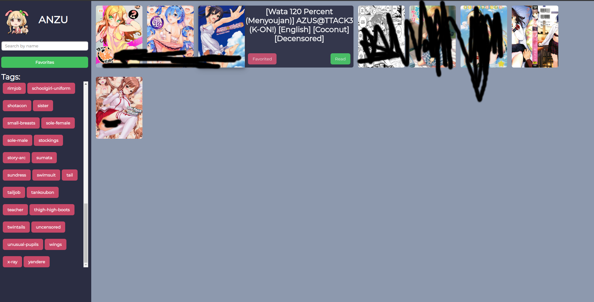

# Anzu

 
<a href='https://lewlewonics.github.io/Anzu/'>Live Demo: (NSFW)</a>
What is Anzu?
---------------
Anzu is a simple front-end for [RicterZ's](https://github.com/RicterZ/nhentai "RicterZ's") nhentai downloader. To use this you will download the comics through his nhentai downloader tool. 

How to use
------------
You want to move the each doujin to the folder named 'folder' and run the shell script `./rename.sh` will still in this folder.
***Note: You need execute permissions so if it doesn't let you run via `./rename.sh` try `chmod 700 rename.sh` first, basically you just want to rename the files 1, 2, 3 ...however many there are***
Once that's done just open the index.html file in the Anzu directory and enjoy viewing your hentai.

WIP
-------------
I still need to save favorites via browser cache so don't worry I'm aware that part doesn't fully work.

There are some entries that will appear blank, this is not a problem on my end, but more so the tool you use to download the hentai. It's beyond my skill to fix.
